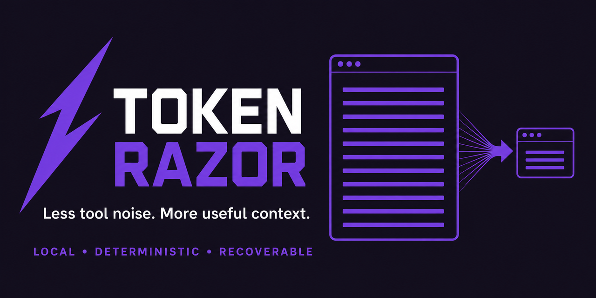

# Token Razor

[](https://github.com/Kolikkii/token-razor/actions/workflows/ci.yml)
[](LICENSE)



**Stop feeding your coding agent megabytes of repetitive output.**

Token Razor is a local Codex plugin that reduces large tool results before they enter the model context. Compression is deterministic, uses no model call, and keeps the original result in a short-lived recovery archive.

On the included deterministic synthetic fixtures, it reduces **902,484 → 9,054 characters (99.0%)** while retaining every embedded failure sentinel. This is a component benchmark, not a token, cost, or task-quality claim.

## Install

```bash
codex plugin marketplace add Kolikkii/token-razor
codex plugin add token-razor@token-razor
```

Start a new Codex thread and open `/hooks`. Codex requires review and trust whenever a non-managed hook is new or changes.

Node.js 20 or newer is required. There are no runtime package dependencies.

## Behavior

Token Razor installs six hooks:

- `UserPromptSubmit` selects a mode for the current turn when the prompt asks for one.
- `PreToolUse` rewrites only a simple oversized `cat FILE` command into a bounded read.
- `PostToolUse` compresses large text results and replaces the original model-visible result.
- `SessionStart` reports that the plugin is active.
- `PostCompact` and `Stop` prune local state.

The compressor flattens JSON into unambiguous paths, samples very long arrays across their full range, removes terminal control codes, redacts common credentials, groups repeated JSON fields and source-search matches, and scores diagnostic lines before sampling the remaining output. Failures are always prioritized. Failure results get 35% more space, up to the `safe` limit. Images, audio, video, small results, and explicit verbatim requests pass through unchanged.

Selected lines stay in source order. Exact rendering costs include omission markers, so a late high-priority error is not lost to a final hard truncation. If compression or storage fails, the hook exits without blocking the underlying tool.

## Modes

| Mode | Character budget | Intended use |
| --- | ---: | --- |
| `safe` | 8,500 | unfamiliar code and high-risk debugging |
| `balanced` | 6,000 | normal development work |
| `extreme` | 3,200 | repetitive output and explicit token minimization |
| `passthrough` | unlimited | verbatim output |

The current turn can request a mode in plain language. `TOKEN_RAZOR_MODE` sets an environment default, and `TOKEN_RAZOR_DISABLED=1` disables processing.

## Recovery and CLI

Compressed results include a `TR-XXXXXXXXXXXX` ID, an exact search command, and a compact restore substitution when an archive is available.

```bash
node scripts/cli.mjs search TR-XXXXXXXXXXXX "error message" --context 3
node scripts/cli.mjs restore TR-XXXXXXXXXXXX
node scripts/cli.mjs preview ./large.log --mode extreme
node scripts/cli.mjs stats --json
node scripts/cli.mjs archives
node scripts/cli.mjs doctor
```

Search the archive first and restore it only when a narrow match is insufficient. A narrow rerun or file slice is usually cheaper still.

## Configuration

Copy [`config.example.json`](config.example.json) to `.token-razor.json` in a workspace. A project file overrides `PLUGIN_DATA/config.json`; environment flags take precedence over both.

```json
{
  "mode": "balanced",
  "archive": {
    "enabled": true,
    "ttlHours": 24,
    "maxMiB": 64
  },
  "metricsRetentionDays": 30
}
```

See [`skills/minimize-token-usage/references/algorithms-and-configuration.md`](skills/minimize-token-usage/references/algorithms-and-configuration.md) for every setting.

## Measurement

```bash
npm run bench
```

Fixture-level results and limitations are documented in [`docs/performance.md`](docs/performance.md); use [`docs/evaluation.md`](docs/evaluation.md) for an end-to-end comparison protocol.

## Where it fits

Token Razor bounds noisy tool output at the Codex hook boundary. [Ponytail](https://github.com/DietrichGebert/ponytail) guides implementation size instead, so the two can be used together.

## Development

```bash
npm test
npm run validate
npm run bench
```

CI covers Node.js 20, 22, and 24 on Linux, macOS, and Windows. Contribution rules are in [`CONTRIBUTING.md`](CONTRIBUTING.md).

## Data handling

Token Razor makes no network requests and sends no telemetry. Summaries redact common credential formats. Raw recovery archives may still contain secrets from the original output; they are local, permission-restricted where supported, protected from symlink reads, and bounded by age and size. Disable archives with `"archive": { "enabled": false }` when local retention is not acceptable.

Security reports are covered by [`SECURITY.md`](SECURITY.md). The project is licensed under [MIT](LICENSE).
